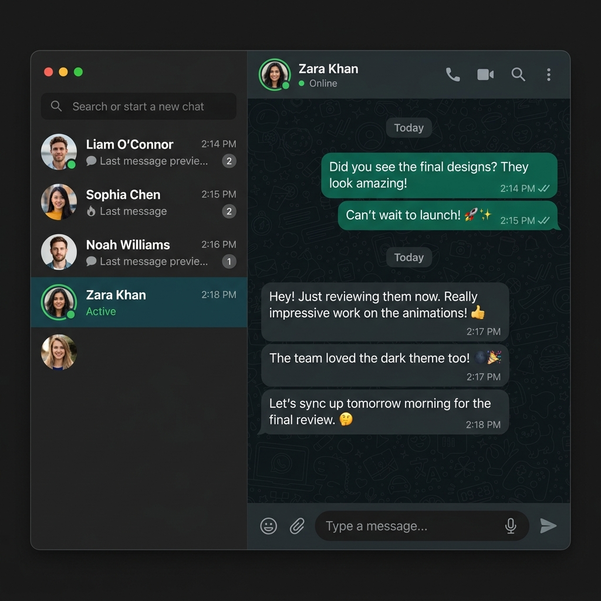

<div align="center">


<br/>

<p>
  <a href="https://render.com">
    
  </a>
  <a href="https://nodejs.org">
    
  </a>
  <a href="https://reactjs.org">
    
  </a>
  <a href="https://socket.io">
    
  </a>
  <a href="https://www.mongodb.com/atlas">
    
  </a>
  
</p>

<p>
  
  
  
</p>

<br/>

> **A blazing-fast, WhatsApp-inspired real-time chat app — Web Push Notifications, Voice Notes, Socket.io events, emoji reactions, reply threads, image sharing, and 32 switchable themes. Zero polling. Pure vibes.**

<br/>

**[🚀 Live Demo](https://fullstack-chat-app-XXXX.onrender.com)** &nbsp;·&nbsp; **[🐛 Report Bug](https://github.com/UTKARSHH20/fullstack-chat-app/issues)** &nbsp;·&nbsp; **[✨ Request Feature](https://github.com/UTKARSHH20/fullstack-chat-app/issues)**

<br/>

</div>

---

## 📸 Preview

<div align="center">
  
</div>

<br/>

---

## ✨ Features

<table>
  <tr>
    <td valign="top" width="50%">

### 💬 Messaging
- 🔴🟢 **Real-time presence** — see who's online the instant they log in
- ⚡ **Instant messaging** — delivered in milliseconds via Socket.io, zero polling
- 🎤 **Voice Notes** — record and send native audio messages directly in the chat
- 🔔 **Web Push Notifications** — get native OS alerts via Service Workers even when offline
- ↩️ **Reply threads** — reply with a quoted preview embedded in the bubble
- 🗑️ **Live deletion** — deleted messages vanish from both sides instantly
- 😊 **Emoji picker** — 6 categorized tabs (Smileys, Gestures, Hearts, Activities, Food, Nature) with cursor-aware insertion

    </td>
    <td valign="top" width="50%">

### 🎨 Experience
- 🖱️ **WhatsApp-style context menu** — right-click for reactions, reply, copy, delete
- 🖼️ **Image attachments** — Cloudinary upload with client-side preview before sending
- 📱 **Fully mobile responsive** — single-panel on phone, dual-panel on desktop
- 🔍 **New Chat search** — find any registered user by name
- 🎨 **32 switchable themes** — DaisyUI grid, persisted across sessions
- 🔐 **JWT auth** — HTTP-only cookies, XSS-immune sessions

    </td>
  </tr>
</table>

---

## 🛠 Tech Stack

<div align="center">

### Frontend
| Tool | Version | Purpose |
|:-----|:-------:|:--------|
|  | 19 | UI framework |
|  | 8 | Build tool & dev server |
|  | v4 | Utility-first styling |
|  | v5 | Component library + 32 themes |
|  | latest | Lightweight global state |
|  | 4.x | Real-time event handling |
|  | v7 | Client-side routing |
|  | latest | HTTP client with interceptors |

### Backend
| Tool | Version | Purpose |
|:-----|:-------:|:--------|
|  | v24 | Runtime |
|  | 5 | HTTP server + API routing |
|  | 4.x | WebSocket server |
|  | latest | MongoDB ODM |
|  | latest | Session tokens |
|  | latest | Image storage & CDN |

### Infrastructure
| Service | Role |
|:--------|:-----|
|  | Cloud database |
|  | Media CDN |
|  | Full-stack deployment |

</div>

---

## 📦 Installation

### Prerequisites

Before you begin, make sure you have:

```
✅ Node.js >= 18
✅ A MongoDB Atlas account  (free tier works great)
✅ A Cloudinary account     (free tier works great)
```

### 1. Clone the repository

```bash
git clone https://github.com/UTKARSHH20/fullstack-chat-app.git
cd fullstack-chat-app
```

### 2. Install dependencies

```bash
# Backend
npm install --prefix backend

# Frontend
npm install --prefix frontend
```

---

## ⚙️ Environment Variables

Create a `.env` file inside the `backend/` directory:

```env
# ── Database ──────────────────────────────────────────
MONGODB_URL=your_mongodb_atlas_connection_string

# ── Server ────────────────────────────────────────────
PORT=5001
NODE_ENV=development

# ── Auth ──────────────────────────────────────────────
JWT_SECRETKEY=your_super_secret_key

# ── Cloudinary ────────────────────────────────────────
CLOUDINAR_CLOUD_NAME=your_cloudinary_cloud_name
CLOUDINAR_API_KEY=your_cloudinary_api_key
CLOUDINAR_API_SECRET=your_cloudinary_api_secret

# ── Web Push Notifications ────────────────────────────
VAPID_PUBLIC_KEY=your_vapid_public_key
VAPID_PRIVATE_KEY=your_vapid_private_key
VAPID_SUBJECT=mailto:test@example.com
```

Create a `.env` file inside the `frontend/` directory:

```env
VITE_VAPID_PUBLIC_KEY=your_vapid_public_key
```

> ⚠️ **Never** commit `.env` to version control. It is already listed in `.gitignore`.

---

## ▶️ Running the Project

### Development

Open two terminals and run:

```bash
# Terminal 1 — Backend (http://localhost:5001)
cd backend && npm run dev

# Terminal 2 — Frontend (http://localhost:5173)
cd frontend && npm run dev
```

Then visit **[http://localhost:5173](http://localhost:5173)** 🎉

### Production Build

```bash
# From the project root
npm run build   # installs deps + builds the React app
npm start       # starts Express, which serves the built frontend
```

---

## 🌐 Deployment

This app deploys as a **single service on Render** — the Express backend serves the compiled React frontend in production. No separate static hosting needed.

<details>
<summary><b>📋 Render Configuration (click to expand)</b></summary>

<br/>

| Setting | Value |
|:--------|:------|
| **Build Command** | `npm install --prefix backend && npm install --prefix frontend && npm run build --prefix frontend` |
| **Start Command** | `npm run start --prefix backend` |
| **Node Version** | `24` |
| **Environment Variables** | _(set all variables from the `.env` section above)_ |

> The backend uses `express.static` to serve `frontend/dist` and a catch-all `app.use()` handler for SPA routing. Note: `app.get("*")` is intentionally avoided due to an Express 5 + path-to-regexp v8 incompatibility.

</details>

---

## 📁 Folder Structure

```
fullstack-chat-app/
│
├── 📂 backend/
│   └── src/
│       ├── controllers/
│       │   ├── auth.controller.js
│       │   └── message.controller.js
│       ├── lib/
│       │   ├── cloudinary.js
│       │   ├── db.js
│       │   ├── socket.js
│       │   ├── webpush.js
│       │   └── utils.js
│       ├── middleware/
│       │   └── auth.middleware.js
│       ├── models/
│       │   ├── message.model.js
│       │   └── user.model.js
│       ├── routes/
│       │   ├── auth.route.js
│       │   └── message.route.js
│       └── index.js
│
├── 📂 frontend/
│   ├── public/
│   │   └── service-worker.js
│   ├── components/
│   │   └── Navbar.jsx
│   ├── lib/
│   │   ├── axios.js
│   │   └── socket.js
│   ├── pages/
│   │   ├── ChatPage.jsx
│   │   ├── LoginPage.jsx
│   │   ├── ProfilePage.jsx
│   │   ├── SettingsPage.jsx
│   │   └── SignUpPage.jsx
│   └── src/
│       ├── store/
│       │   ├── useAuthStore.js
│       │   ├── useChatStore.js
│       │   └── useThemeStore.js
│       ├── App.jsx
│       └── main.jsx
│
├── .gitignore
└── package.json
```

---

## 🔐 Authentication Flow

```
┌─────────────┐     hash pw      ┌──────────────┐    JWT cookie    ┌────────────────┐
│   Sign Up   │ ───────────────► │   bcryptjs   │ ───────────────► │  HTTP-only     │
│   /login    │                  │  (10 rounds) │                  │  Secure Cookie │
└─────────────┘                  └──────────────┘                  └────────────────┘
       │                                                                    │
       │  Page refresh                                              ┌───────▼────────┐
       └──────────────────── checkAuth() ──────────────────────── │ auth.middleware │
                             reconnects socket                      └────────────────┘
```

1. User signs up → password hashed with `bcryptjs` (10 salt rounds)
2. On login, a JWT is signed with **15-day expiry** and set as a `Secure`, `SameSite=Strict` cookie
3. All protected API routes verify the token via `auth.middleware.js`
4. On page refresh, `checkAuth()` re-validates the session and reconnects the socket
5. On logout, the cookie is cleared and the socket connection is terminated

---

## 🧠 Key Engineering Highlights

<details>
<summary><b>⚡ Real-time Architecture</b></summary>
<br/>

Express and Socket.io share a **single HTTP server instance**. A `userId → socketId` map held in memory enables direct message routing to specific clients — no broadcasting to everyone, no unnecessary noise.

</details>

<details>
<summary><b>🔔 Web Push Integration</b></summary>
<br/>

A robust implementation of the Web Push API using Service Workers and VAPID keys. If the recipient is offline (no active Socket connection), the backend automatically triggers a native OS-level push notification to alert them.

</details>

<details>
<summary><b>↩️ Reply Threading</b></summary>
<br/>

Replied messages store a `replyTo` snapshot (sender name + message text) **directly on the message document**. The thread context is always preserved even if the original message is later deleted — no orphaned threads.

</details>

<details>
<summary><b>🔧 Express 5 Wildcard Fix</b></summary>
<br/>

`path-to-regexp` v8 (used internally by Express 5) rejects bare `"*"` route patterns at startup. The SPA catch-all fallback uses `app.use()` instead, which bypasses the regex engine entirely and works perfectly.

</details>

<details>
<summary><b>🔍 Sidebar Privacy Design</b></summary>
<br/>

Instead of listing all registered users (which would expose your entire user base), the sidebar **only shows people you've already messaged**. A dedicated `GET /api/messages/search?q=` endpoint powers the "New Chat" modal for discovering new people.

</details>

<details>
<summary><b>📱 Mobile Layout</b></summary>
<br/>

No framework tricks needed — a simple `hidden md:flex` toggle on the sidebar and chat panel gives a **native-feeling single-panel experience** on mobile, with proper back navigation on small screens.

</details>

---

## 🤝 Contributors

<div align="center">

<a href="https://github.com/UTKARSHH20/fullstack-chat-app/graphs/contributors">
  
</a>

<br/><br/>

**Built and battle-tested by [Utkarsh](https://github.com/UTKARSHH20)**

</div>

### Want to contribute?

```bash
# Fork the repo, then:
git checkout -b feature/your-feature-name
git commit -m "feat: describe your change"
git push origin feature/your-feature-name
# Open a Pull Request ✅
```

> Please keep PRs focused — avoid mixing unrelated changes in a single PR.

---

## 📜 License

Distributed under the **MIT License**. See [`LICENSE`](LICENSE) for more information.

---

<div align="center">


<br/>

**Built with ☕ and way too many Stack Overflow tabs**

<br/>

⭐ **If this project helped you, consider dropping a star — it genuinely means a lot!** ⭐

</div>
